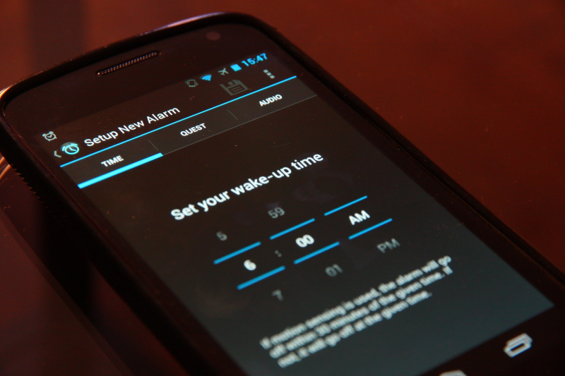
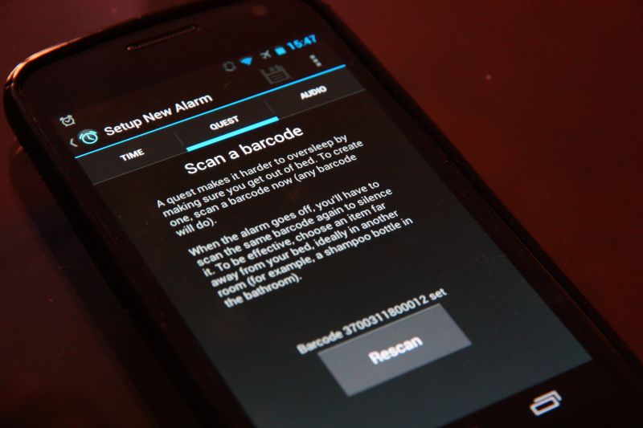
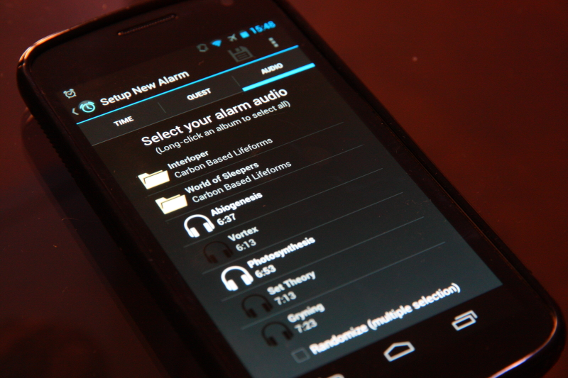

# android-alarm

The beginnings of an alarm clock app developed in Android's old Eclipse SDK. Mainly just checking out the Android development process, which I found generally frustrating enough that I decided to shift my focus toward learning javascript-based web applications instead. 

I had intended to borrow some concepts from alarm clock apps I had used and liked (such as the need to get out of bed and scan a barcode with the phone camera in order to turn off the alarm). But I hadn't found a single app that had all the features I wanted.

I found it surprisingly difficult to get the interface to do what I wanted, especially in the ExpandableListView used to browse the albums and songs to select the alarm ringtones. Any nonstandard functionality required a great deal of effort and trial and error to implement. A seemingly simple goal of accessing audio playlists I had saved in the Google Play app became a major challenge because the Google Play developers had chosen to store the playlists in a location that was, as far as I could tell, entirely undocumented. 

I'll probably take another look at Android at some point, because I assume it will get easier to work with as the platform matures. But for now, I've had a much better experience working with javascript.